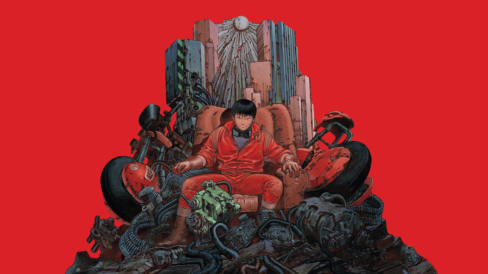

<h1 align="left">
  
</h1>

<details>
<summary>
<h3> EXECUTE COMMAND — SHOW OUTPUT</h3>
</summary>

<div align="center">

```bash
================================[ USER INFO ]================================
```
</div>

<p align="center">
  
</p>

<div align="center">

```bash
================================[ ABOUT ME ]================================

[ User: ere6u5 ]
[ Status: Learning | Growing | Hacking | Resting ]

[ Specialization: Security Overlord | Pentest God | Reverse Engineering Wizard ]

[ Mission: Understand how everything works → then break it properly ]
[ Motto: "Why have root when you can be root?" ]

[ Languages: Golang | C/C++ | Python | Kotlin | JavaScript | Bash ]
[ Shells: zsh | bash | Python ]
[ Editor: vim > everything else ]
```
</div>

</details>

---

<h2 align="left">
  </b>
</h2>

<details>
<summary>
<h3> EXECUTE COMMAND — SHOW OUTPUT</h3>
</summary>

<div align="left">

<h3 align="left">
  </b>
</h3>

<details>
<summary>
<h4> EXECUTE COMMAND — SHOW OUTPUT</h4>
</summary>

2+ years deep in application security battlefield. 
Transforming vulnerabilities into features and building 
security that doesn't slow down development. 
Specializing in making security sexy and automated.

___"When security becomes a bottleneck, you're doing it wrong."___

#### `TECHNICAL SKILLS`

| **Security Domain**       | **Technologies & Tools**                          | **Proficiency** |
|---------------------------|---------------------------------------------------|-----------------|
| **SAST/DAST**             | Semgrep, CodeQL, SonarQube, OWASP ZAP            | ⭐⭐⭐⭐⭐         |
| **API Security**          | Postman, Burp Suite, OWASP API Top 10            | ⭐⭐⭐⭐⭐         |
| **CI/CD Security**        | GitHub Actions, Jenkins, GitLab CI               | ⭐⭐⭐⭐⭐         |
| **Secure Architecture**   | Threat Modeling, SDLC Integration                | ⭐⭐⭐⭐          |
| **Code Review**           | Manual + Automated Audit Techniques              | ⭐⭐⭐⭐⭐         |
| **DevSecOps**             | Pipeline Security, Automated Testing             | ⭐⭐⭐⭐          |


#### `SHOWCASE PROJECTS`

##### ___**OWASP Research Suite**___
[](https://github.com/ere6u5/owasp-top10-api-vulnerabilities)
[](https://github.com/ere6u5/owasp-top10-vulnerabilities)

*Deep dive into OWASP Top 10 vulnerabilities with practical examples and mitigation strategies*

##### ___**Security Testing Tools**___
[](https://github.com/ere6u5/juice-shop-sast-analysis)
[](https://github.com/ere6u5/linter-secure-audit)

*Advanced SAST analysis and security linter configuration for enterprise-grade code auditing*

##### ___**CI/CD Security Pipeline**___
[](https://github.com/ere6u5/nyx)

**Architected full security integration into SDLC:**
- **Test Stage**: Automated SAST/DAST scanning
- **Build Stage**: Security-hardened container builds  
- **Deploy Stage**: Security validation and compliance checks

</details>

---

<h3 align="left">
  </b>
</h3>

<details>
<summary>
<h4> EXECUTE COMMAND — SHOW OUTPUT</h4>
</summary>


2+ years on the frontlines of Security Operations.
Hardening perimeters, automating defenses, and hunting threats.
Specializing in building resilient security infrastructures that just work.

___"Defense is not a state, it's a continuous process."___

#### `TECHNICAL SKILLS`

| **Security Domain**       | **Technologies & Tools**                          | **Proficiency** |
|---------------------------|---------------------------------------------------|-----------------|
| **Firewall Administration** | Check Point, Fortigate, PT AF, Threat Prevention | ⭐⭐⭐⭐⭐         |
| **VPN & Cryptography**    | ViPNet, Континент, S-Terra, КриптоПро, GOST      | ⭐⭐⭐⭐⭐         |
| **DDoS Mitigation**       | Mitigator, Гарда, Provider Coordination          | ⭐⭐⭐⭐⭐         |
| **Email Security**        | Fortimail, Anti-Spam, Anti-Phishing, SEG         | ⭐⭐⭐⭐          |
| **SIEM & Monitoring**     | Event Analysis, Incident Response, Shift Work    | ⭐⭐⭐⭐⭐         |
| **Infrastructure & Virtualization** | VMware, VirtualBox, Linux (Bash), Windows Server | ⭐⭐⭐⭐          |

#### `KEY ACHIEVEMENTS`

##### ___**SOC Automation & Tooling**___
**Scripted solutions for mass network device configuration via SSH (Python)**, slashing deployment times and eliminating human error in critical security changes.

##### ___**Complex Incident Management**___
**Led mitigation efforts for large-scale DDoS attacks**, coordinating with providers and manually managing blacklists to maintain service availability for clients.

##### ___**Infrastructure Hardening**___
**Administered a full stack of defensive systems (Firewalls, VPN, HSMs, Mail Gateways)**, ensuring policy optimization, threat prevention, and cryptographic compliance across hybrid environments.

##### ___**Security as a Service**___
**Delivered expert security outsourcing for multiple clients**, from daily monitoring and backup management to in-depth analysis and consultation on secure service configuration.

</details>

---

<h3 align="left">
  </b>
</h3>

<h3 align="left">
  </b>
</h3>

work

</div>

</details>

---

<h2 align="left">
  </b>
</h2>

<details>
<summary>
<h3> EXECUTE COMMAND — SHOW OUTPUT</h3>
</summary>

<div align="center">

<a href="https://github.com/ere6u5">
  
</a>
<a href="https://github.com/ere6u5?tab=repositories">
  
</a>


</div>

</details>

---

<h2 align="left">
  </b>
</h2>

<details>
<summary>
<h3> EXECUTE COMMAND — SHOW OUTPUT</h3>
</summary>

<div align="center">

work

</div>

</details>

---

<h2 align="left">
  </b>
</h2>

<details>
<summary>
<h3> EXECUTE COMMAND — SHOW OUTPUT</h3>
</summary>


#### `DIGITAL PRESENCE & NETWORKS`

| Platform | Badge | Description |
|:--------:|:-----:|:------------|
| **GitHub** | [](https://github.com/ere6u5) | Main code repository and projects |
| **GitLab** | [](https://gitlab.com/ere6u5) | Alternative projects and CI/CD |
| **Telegram** | [](https://t.me/ere6u5) | Fast communication and chats |
| **Telegram Channel** | [](https://t.me/erebnet) | Write-ups, solutions, and infosec insights |
| **HH.ru** | [](https://samara.hh.ru/resume/ffa04e22ff0de27dd50039ed1f4c5532755476) | Professional resume and experience |

#### `COMMUNITY & REACH`

[](https://github.com/ere6u5)
[](https://github.com/ere6u5)
[](https://github.com/ere6u5)


</details>

---
